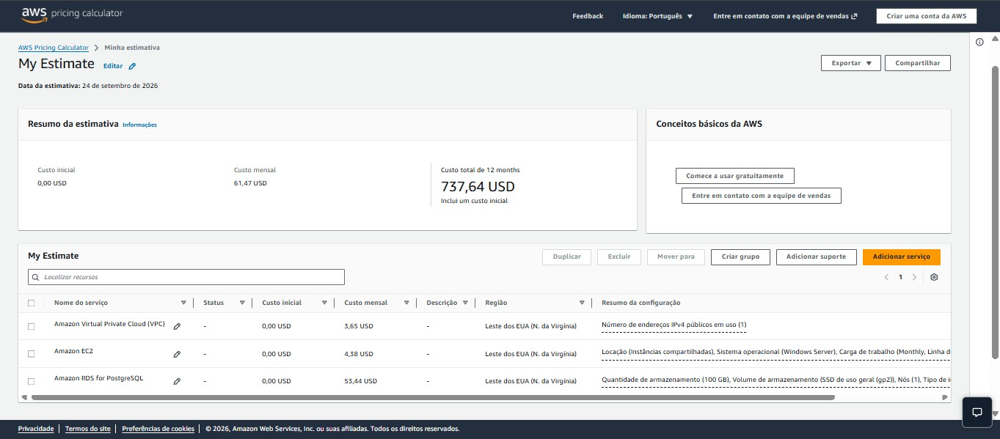

   
  

# Tech Challenge Fase 1

Em fase de conclusão do projeto "ToggleMaster" de acordo com o que foi proposto. Espera-se atingir as seguintes fases:

1° (App.py)              = Variável de ambiente monolítico em phayton
2° (Dockerfile)          = Rodar a estrutura monolítico
3° (Docker-compose.yaml) = Rodar a estrutura local
4° (README.md)           = Pre-resquisitos para rodar local/aws, como também (End points  para testar as chamadas de Apis [Postman ou curl])

## 🖥️ Proposta

O objetivo é validar a comunicação com a API que permita: criar, ler, atualizar e deletar feature flags sem a necessidade de um novo deploy. Logo, o projeto visa criar e implantar o (Produto Mínimo Viável), que consiste em uma API monolítica para gerenciar as  feature flags.

## 📋 O Propósito é utilizar os fundamentos do "DevOps/Cloud" no sentido de:

- Examinar o ambiente monolítico.
- Debater as vantagens e desvantagens.
- Analisar os 12 fatores.
- Projetar a arquitetura de nuvem WEB/AWS.
- Implementar recursos na AWS (VPC, EC2, RDS, Security Groups).
- Configurar práticas de segurança na AWS (IAM, Security Groups).

## 📌 Resultados da Fase 1

1. [**Demonstração (vídeo 15 minutos):**](https://youtu.be/teste)

2. **Divisão por Tópicos:**

- [Estudo monolito](#Por-qual-motivo-o-projeto-é-monolito);
- [Beneficios](#beneficios);
- [Desvantagnes](#desvantagens);
- [Analises dos 12 Fatores](#analises-dos-12-fatores);
- [Performace](#performace);
- [Link do diagrama](https://excalidraw.com/#json=xmeLtXuGWBvNmcuFlCBde,Y9SUpEMCvxw6mgpuzFXjsQ);
- [Imagem do diagrama](#diagrama-de-arquitetura-aplicada);
- [Calculator](#calculadora-com-estimativa-de-preço);

3. **Integrantes do Grupo:**

- [Rodrigo Augusto Hentz Alves](https://www.linkedin.com/)
- [Bruno de Assis Fernandes](#)
- [Vinicius Kostriuba](https://www.linkedin.com/)
- [Matheus Menezes Duarte](#)
- [Paulo Ricardo Ribeiro dos Santos](https://www.linkedin.com/)

## 📘 Por qual motivo o projeto é monolito?

Trata-se de uma aplicação desenvolvida para ambiente (local/.exe), de modo que a interface, serviços e Dlls compartilham do mesmo diretório da aplicação. Essa abordagem simplifica a instalação, homologação/testes e entendimento da regra de negócio.

## 🧲 Benefícios

Aplicação é gerenciada pelo time de TI, pois são eles os responsáveis pela instalação, criação e controle. Detêm de toda a documentação do projeto implantado.

## 📉 Desvantagens

Dependem de atualizações do fornecedor/desenvolvedor relacionado à performace e melhorias. Ou seja, disponibilizada uma nova versão, o time de ti precisa atualizar a vesão do (.exe, componentes e escalabilidade do banco de dados).

## ‼️ Análises dos 12 Fatores

 - "Descrever os resquisitos baseado na aplicação desenvolvida(monolito)."
 - Se -> (Atente, Atende(parcialmente) ou Não atende.)

## 🧠 Performace

Descrever:

## 🔗 Link do diagrama

();

## 📝 Diagrama de Arquitetura Aplicada

##💲Calculator

